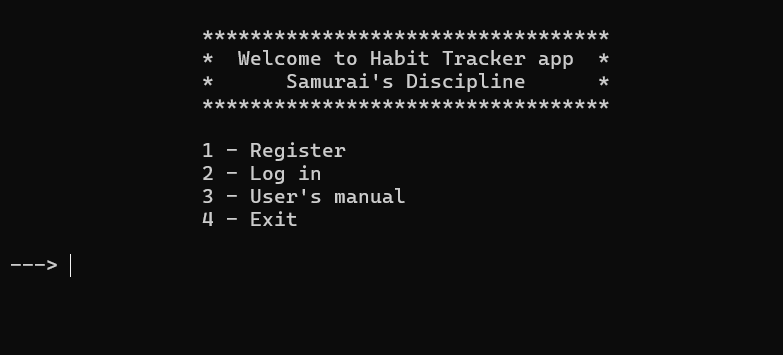
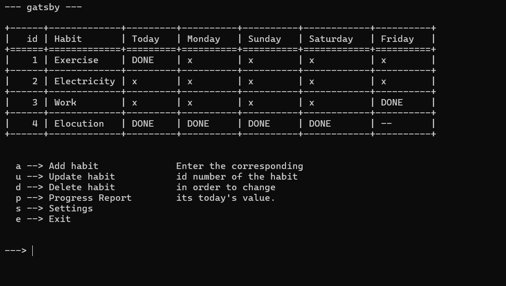
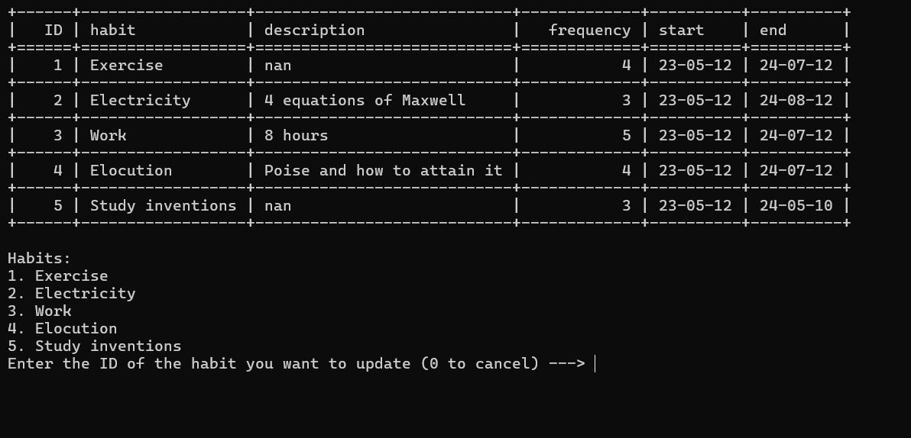
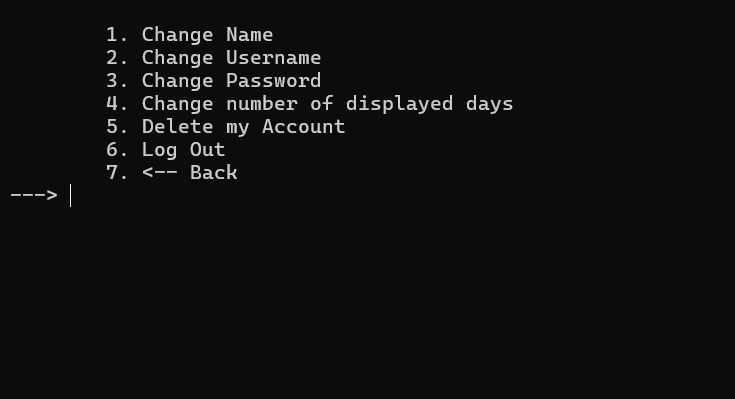
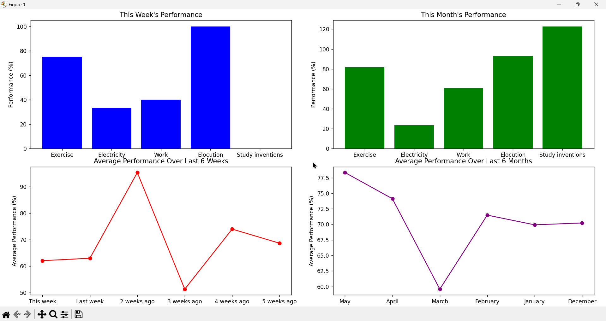

# Samurai's Discipline

This is console-based Habit Tracker application, which includes the following **functionalities** and **features**:
1. User Authentication (registration and log in)
2. Encryption of passwords and names of files
3. User's Manual
4. Menu that displays table of habits and recent days
5. Adding, Updating, Deleting habits
6. Variety of progress statistics of the user (4 graphs)
7. Settings of account and displayed table

Other technical details:
1. The app solely relies on CSV files for storing data
2. Binary search for finding the username
3. Advanced custom Caesar Encryption method
4. Validations (password, username, etc)

## How to Use?

1. Unzip zipped folder
2. Open main.py 
3. Open the app with native console of the Windows OS. (cmd)
4. Use the app in fullscreen mode in order to avoid any displaying issues.

When the app is opened, welcoming page will be seen as below, where you can register or log in:

--- You can register as a new user, but you will have to add habits and you will have no progress history to visualize. That is why, you can log in to existing account with some history.
Account details:
username: gatsby
password: Gatsby1!

--- When you log in, you can see the following menu page, where your current habits and recent days are shown.

You have variety of options there, also you can enter the ID of the habit in the table in order to change its value for today.

You can add a habit by entering "a" or "add". Same applies to other options too.

--- For example, we can update a habit by entering "u" or "update":

--- Or you can go into settings and change your account details or displayed table related instance:

--- You can see your performance for last week and last month for each habit, or general average progress for last 6 weeks or monthes:

## Find a Bug

If you found any bug, or have some feedback on how to improve the product, you can fill out the [The Google Forms](https://docs.google.com/forms/d/e/1FAIpQLSe5HqEexhwNmDsihB1Ipqanh7TqP5CdyXhxgm49ocS7fBPE4A/viewform?usp=sf_link).
<a href="https://docs.google.com/forms/d/e/1FAIpQLSe5HqEexhwNmDsihB1Ipqanh7TqP5CdyXhxgm49ocS7fBPE4A/viewform?usp=sf_link" target="_blank">link</a>
## 👋🏻

